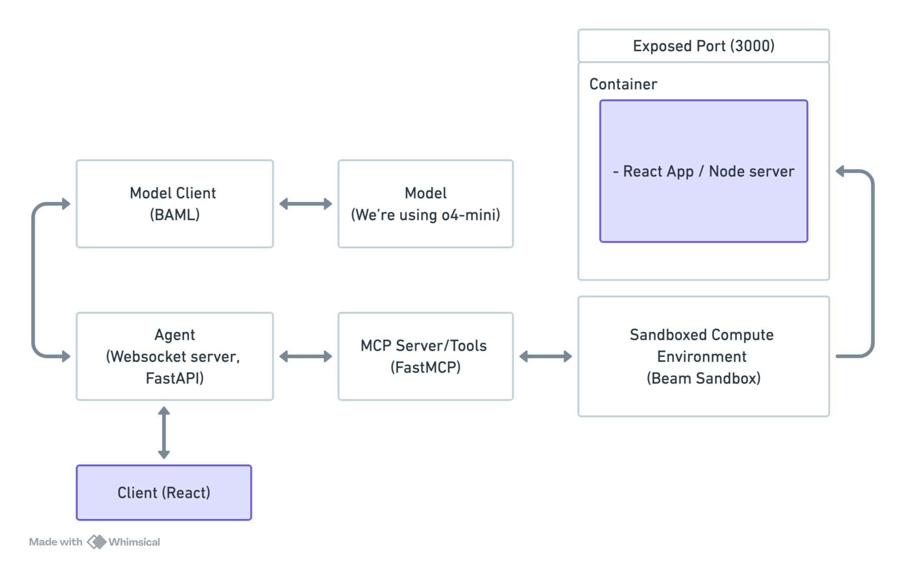

# Holly Code - AI-Powered Web App Builder

A real-time AI-powered web application builder.

## Architecture

This project demonstrates how to build a simple agent using sandboxed environments, MCP servers, and [BAML](https://github.com/BoundaryML/baml).

The application consists of three main components:

1. **Model Client** - Communication with LLM, based on [BAML](https://github.com/BoundaryML/baml)
2. **Sandbox Environment** - Runs the React preview in a compute sandbox
3. **WS-Based Agent** - Streams edit requests from the user to the agent



## Prerequisites

- Python 3.12+
- Node.js 20+
- Anthropic API key

## Installation

1. **Clone and install**

   ```bash
   git clone https://github.com/ibuildstuffwithai/holly-code
   cd holly-code
   pip install -r requirements.txt
   ```

2. **Install frontend dependencies**

   ```bash
   cd frontend
   npm install
   ```

3. **Set up environment**

   Create an `.env` file with your Anthropic API key and WebSocket URL.

## Usage

### Start the Agent

```bash
beam serve src/agent.py:handler
```

### Run the Frontend

```bash
cd frontend
npm run dev
```

### BAML / Prompts

Prompts are defined in `baml_src/build.baml`. Edit and run `make generate` to regenerate BAML clients.
